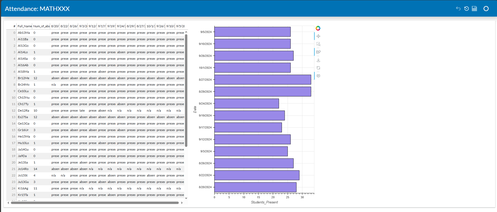

# Canvas Attendance
When exporting attendance from Canvas, instructors will receive a CSV file, such as the one below:


where each row is an attendance for a single student, on a single day. This means that by the end of the semester, there will be multiple rows with the same same student, recorded on different days.

---

This Jupyter notebook, ```Canvas_Attendance.ipynb```, takes the most recenlty downloaded attendance csv file and creates a readable dashboard, similar to the screenshot below.



---
Be sure to update the code so that the python script searches in **your** Downloads folder. 